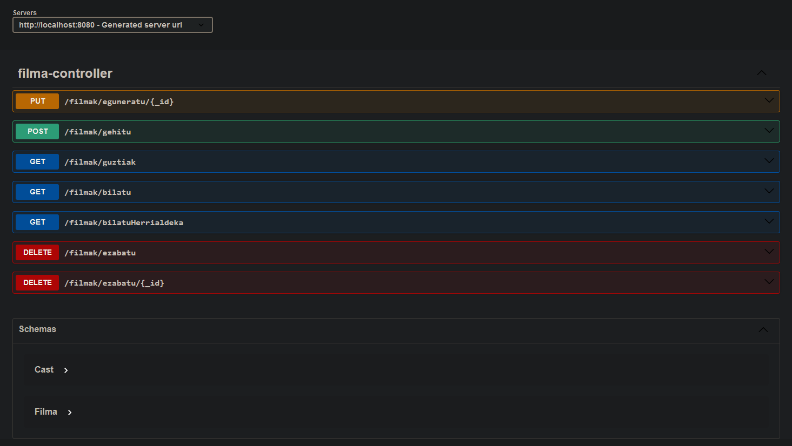
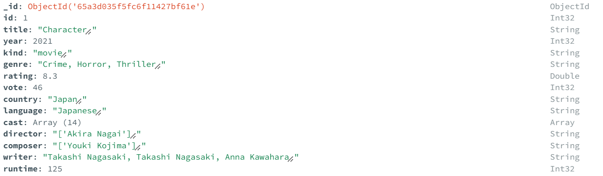

# FilmakRestApi
The aim of this project is to use a Rest API to access data from a Mongo database using Spring Java technology. For that purpose, a dataset was selected to be loaded into the Mongo database, that includes almost 10K movies from Netflix digital platform. 

## Dataset
At first, the dataset doesn't contain any Objects or Arrays. Instead, it has only Strigns and Integers. As the main point of the project was to work with a certain level of difficulty, the dataset was changed converting an String into a JSONObject Array by using mongosh. So after those changes, the new dataset was ready to be used (in JSON format).

[See dataset](filmak.json)

After that, MongoDB Compass was used to create the database and impoting the dataset into it.

[!NOTE] 
Before importing the dataset a connection to the server is required. (Explained later)

## Rest service
For the rest service Swagger UI was used: http://localhost:8080/swagger-ui/index.html

| Type  | URL (EndPoints)  | Result |
|:------------- |:---------------| :-------------|
| GET         | /filmak/guztiak      | This returns a JSON with the movies             |
| GET         | /filmak/bilatu      | This returns a JSON with the movie id selected             |
| GET         | /filmak/bilatuHerrialdeka      | This returns a JSON with the movies from the country selected       |
| PUT         | /filmak/eguneratu/{_id}        |  Update the movie wiht the selected id  |
| POST         | /filmak/gehitu        | Stores a new movie on the database        |
| DELETE         | /filmak/ezabatu     | Deletes the movie by the name        |
| DELETE         | /filmak/ezabatu/{_id}      |  Deletes the movie by id     |

## Mongo
For using Mongo we need to have mongo installed, and also its client (Compass). Once installed, we can access by using the following:  *mongodb://localhost*

After that, we can create the database with a collection and import the dataset easily. 

**For this porject, the default database name is "filma" and collection name is "filmak". **

Then, the structure of the database will look like this:

## Java
The project is divided into two main different packages: models and controller.

Inside the models package we can find the Filma class, that is the main class of the project. It also has a list "Cast" 
that contains some objects for the Cast class that is on the left of the picture.

As you can see below, there are also two repository classes that are executing the get, post, put and delete operations that we are encountering in Swagger.

Out of those packages we can find SpringConfiguration (gets connection string from application.properties and makes the conversion to JavaObject) and RestapiApplication (for running the program).

